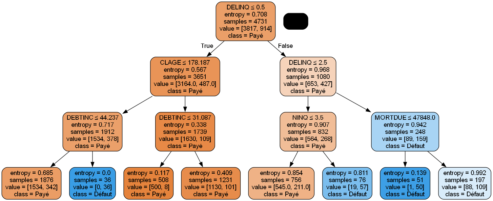
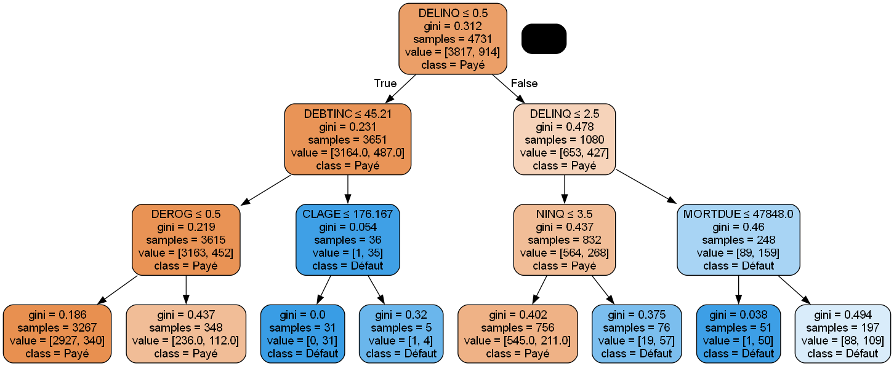

# 🏦 Scoring Crédit – Analyse du Risque d'Emprunteur  
## Ousmane KA – Master 1 SID (UAM)  

Projet académique de Data Science visant à évaluer et prédire le risque d'impayé sur des dossiers de demande de crédit à partir d'un dataset réel d'institutions financières.

## 📂 Structure du projet  

```
Projet_Scoring_vf/
│
├── Dataset/
│   └── hmeq.csv (données sources)
│
├── df_pruned.png
├── df_pruned_model_entropy.png
├── df_pruned_model_gini.png
│
├── Scoring_exploratory_data_analysis_Ousmane_KA.ipynb
├── Scoring_classic_datas_treatment_Ousmane_KA.ipynb
├── Scoring_datas_miticulous__treatment_Ousmane_KA.ipynb
├── Scoring_Reg_Log_Ousmane_KA.ipynb
├── Scoring_Arbre_Decisionnel_Ousmane_KA.ipynb
├── Scoring_Random_Forest_Ousmane_KA.ipynb
├── Scoring_PCA.ipynb
├── Scoring_model_results_comparaison.ipynb
│
└── README.md
```

## 🎯 Objectif  

Mettre en place un processus complet d'analyse et de modélisation pour prédire la capacité des emprunteurs à rembourser un crédit bancaire à partir d'un jeu de données déséquilibré (`hmeq.csv`).

## 🛠️ Technologies utilisées  

| Outils      | Librairies        |
|-------------|-------------------|
| Python      | pandas, numpy      |
| Jupyter     | matplotlib, seaborn|
| Scikit-learn| SMOTE, PCA, GridSearchCV |
| Visualisation| matplotlib, seaborn |

## 🧑‍💻 Étapes détaillées du projet  

### 1️⃣ Analyse Exploratoire des Données (EDA)
- Détection des valeurs manquantes
- Visualisation des distributions
- Corrélation entre variables (heatmap)
- Équilibre des classes (problématique de dataset déséquilibré)

### 2️⃣ Traitement des Données  
- Imputation (médiane, kNN, interpolation)
- Détection et gestion des outliers (BoxPlot, Winsorisation)
- Encodage OneHot
- Standardisation / Normalisation
- Réduction de dimensions (PCA)

### 3️⃣ Modélisation  
- Régression Logistique (Baseline interprétable)
- Arbre de Décision (Optimisation via GridSearch - critères Gini / Entropy)
- Random Forest (Optimisation des hyperparamètres)
- Gestion du déséquilibre via SMOTE / Random Under Sampling

### 4️⃣ Évaluation
- Accuracy / F1-Score / AUC ROC
- Matrice de confusion
- Courbes ROC
- Comparaison des performances via dashboard récapitulatif

## 🔢 Résultats Clés  

| Modèle             | F1-score | AUC ROC | Commentaire                |
|--------------------|----------|---------|-----------------------------|
| Régression Logistique | 0.79   | 0.85    | Baseline interprétable       |
| Arbre de Décision (SMOTE) | 0.82 | 0.88   | Approche robuste             |
| Random Forest (Optimisé)  | 0.86 | 0.90   | Meilleure performance globale |

## 📊 Visualisations  
  
  
  

## 🚀 Recommandation  
✅ Pour un déploiement réel, le modèle **Random Forest optimisé** est conseillé pour son excellent compromis entre précision et rappel.  
✅ Le modèle **Régression Logistique** reste utile pour une interprétation plus simple auprès des décideurs métier.

## 🔗 Liens  
- 📁 [Dataset utilisé : HMEQ (Prêts à la consommation)](https://www.openml.org/d/42165)  
- 💻 [Dépôt GitHub du projet](https://github.com/Ousoka/Projet_Scoring_vf)  

## 👨‍🎓 Auteur  
**Ousmane KA**  
Master 1 SID (Systèmes d'Information et Données)  
Université Amadou Mahtar Mbow (UAM)  
